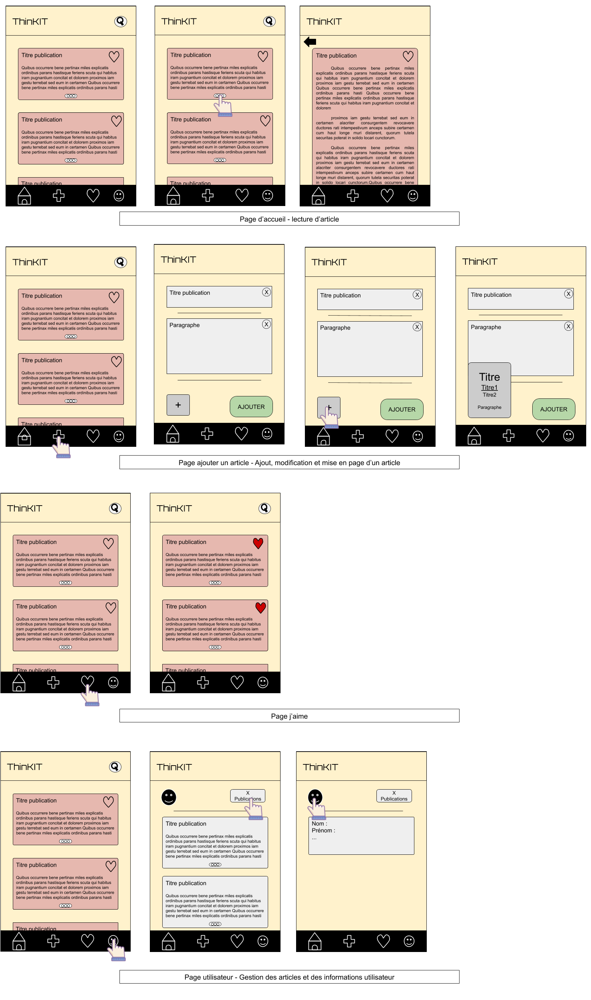

# Task for week: 2020-11-16 - 202027-11-222

## Benjamin BECERRA :
- Install [SQLite](https://www.tutorialspoint.com/android/android_sqlite_database.htm) on Android emulator and do some tests
- INSERT & SELECT some data to test DB connection

## Clément STAUNER :
- Create Node.js server and deploy it on [Heroku](https://www.heroku.com/)
- Create MongoDB Cluster on [Atlas](https://cloud.mongodb.com/)
- Cerate MongoDB relational model (server/src/model)
- Create REST API endpoint using [Express.js](http://expressjs.com/) (test endpoint using [Postman](https://www.postman.com/))

## Thibault TAXIL :

- Draw sketches for UI (docs/sketch)
- Begin to write .java & .xml for UI
- Make routing (navigation between Android Activities)

